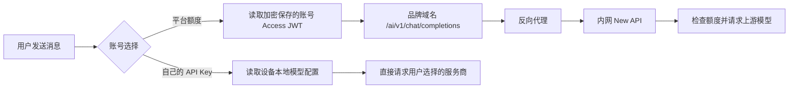

# OmniBot AI 请求双路由

主聊天现在会根据账号中的 AI 使用方式选择请求出口。



## 两种模式的安全边界

- 平台模式只发送账号 Access JWT。用户设备上的第三方地址、API Key、自定义请求头和协议设置全部丢弃，不能覆盖平台鉴权。
- BYOK 模式继续使用原有的设备本地模型配置，API Key 不上传账号服务器。
- Flutter 界面只能读取 `mode`、`ready` 和错误原因，拿不到账号 Token、BYOK Key 或内部 New API 地址。
- Access JWT 过期并收到 HTTP 401 时，主聊天会刷新登录会话并且只重试一次。

## 构建配置

`production` 正式版本默认使用两个公开的 HTTPS 地址：

```properties
OMNIBOT_BASE_URL=https://account.omnimind.com.cn
OMNIBOT_AI_GATEWAY_URL=https://model-api.omnimind.com.cn
```

打包时仍可通过同名构建属性覆盖默认值；`develop` 开发版本没有默认值，需显式配置测试地址。

- `OMNIBOT_BASE_URL` 用于注册、登录和账号设置。
- `OMNIBOT_AI_GATEWAY_URL` 是客户端可见的品牌网关前缀。主聊天会在其后请求 `/v1/chat/completions`。
- 不要把 New API 的内网 IP、管理后台地址、普通 Token 或上游模型 Key 写入 App 构建配置。

服务器反向代理应只把品牌路径转发到内网 New API，例如外部的
`https://model-api.omnimind.com.cn/v1/chat/completions` 转发成 New API 的 `/v1/chat/completions`。

任何手机需要访问的公网网址都可以被手机所有者观察到，因此品牌网关域名本身无法保密；真正需要隐藏、并且当前设计隐藏的是 New API 的内网地址、管理界面和全部上游密钥。

## 当前范围

这次已接通主聊天文本请求。图片生成、语音、模型列表检测等独立请求链路仍沿用各自原有配置，后续要逐条决定是否也使用平台额度，不能未经计费确认就自动切换。
