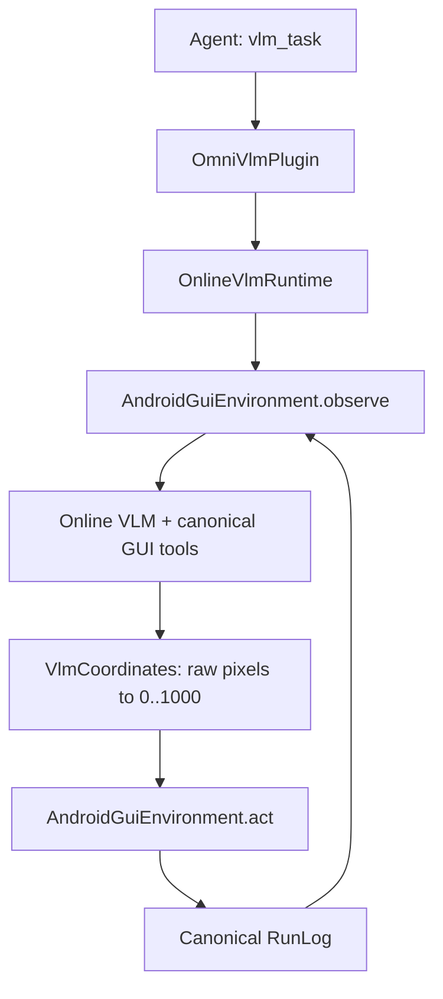

# Online VLM Android Core

`omniflow-android` provides the smallest built-in Online VLM execution path for
OpenOmniBot. It is Android/Kotlin code compiled into the app; enabling Omni VLM
only records plugin state, like enabling a built-in Skill. It does not download
an archive, Python package, Python environment, or NumPy wheel.

## Execution path



The core owns:

- one `run_id` and one active GUI execution;
- the execution overlay, stop handling, and progress callbacks;
- the model-visible tool collection generated from `OobActionSchema`;
- a simple observe → one model tool call → act → observe loop;
- canonical RunLog persistence with the five required truth fields.

`androidgui` remains the only device I/O layer. It captures the current state
and executes canonical Actions. The Online VLM runtime does not add a second
tap, swipe, text-input, or app-launch implementation.

## Install semantics

`OmniVlmLiteProvider` is a `bundled_module` with `downloadSizeBytes = 0`.
`OmniPluginPlatform.install()` writes the local installed state; enable/disable
controls whether `vlm_task` is contributed to Agent sessions. Uninstall removes
only that state. There is no release catalog or package installer for this
built-in capability.

## Coordinate boundary

Canonical Actions and RunLogs store coordinates in `0..1000`. The VLM always
sees and returns raw pixels in the current original device display frame. XML
bounds use that same frame, even when the transported screenshot is compressed.

`VlmCoordinates` is the only Online VLM conversion owner:

- recent canonical action context is converted to raw pixels before every model
  call;
- model tool arguments are range-checked against the current display and then
  converted to canonical coordinates;
- conversion is unconditional, including raw values numerically below `1000`;
- a missing or invalid display fails instead of guessing.

## Model contract

Each turn requires exactly one native function tool call. Tool definitions come
from the canonical Action schema, use `tool_choice=required`, and disable
parallel calls. Unknown tools, fields, invalid JSON types, enum values, and
coordinate ranges fail validation before device execution.

The model receives:

- the user goal and installed Skill guidance;
- current package, activity, original display dimensions, screenshot, and XML;
- installed app labels/package names;
- recent action results converted to the current raw-pixel frame.

Action tools execute on the device. Decision tools finish, request user input,
or abort. Each executed action writes one canonical RunLog step; optional
`summary`, `thinking`, and token usage stay inside step `metadata`.

## Verification

```bash
./gradlew --no-daemon :omniflow-android:testDebugUnitTest
./gradlew --no-daemon :app:testDevelopStandardDebugUnitTest
cd ui && flutter test test/features/home/pages/plugin_market/plugin_market_page_test.dart
```

Device acceptance must additionally exercise Online VLM execution and RunLog
persistence on an Android device or emulator. Function enhancement and replay
remain separate production workflows and are not implemented by this minimal
Online VLM capability.
