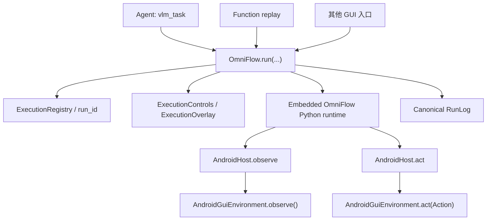

# Android GUI 执行架构

`omniflow-android` 是 OpenOmniBot 中唯一的 Android GUI 执行生命周期模块。在线 VLM、Function 重放以及后续新增的 GUI 入口，都必须通过同一个 `OmniFlow.run(...)` 进入；模块内部再统一处理 Python 运行时、模型调用、悬浮控制、停止、RunLog 和 Android 设备操作。

`androidgui` 是更底层的设备 I/O 模块，只负责观察 Android 状态和执行规范化 `Action`。它不拥有任务生命周期、模型、RunLog 或执行 UI。

## 统一执行链路



这条链路有两个不可替代的统一点：

- 所有交互式 GUI 执行都从 `OmniFlow.run(...)` 开始。
- 所有 Android 动作最终只由 `AndroidGuiEnvironment.act(Action)` 落地。

不要在 Agent、Function、Flutter Channel 或悬浮窗代码中增加第二套执行器。

## 模块职责

### `omniflow-android`

- 创建并校验唯一 `run_id`。
- 串行化 GUI 执行，当前只允许一个活动执行。
- 启动嵌入式 OmniFlow Python 运行时。
- 把 Python 的 `observe`、`act`、模型请求和 RunLog 请求桥接到 Android。
- 管理执行悬浮窗、暂停/接管、继续和停止。
- 统一完成、失败、等待输入和取消语义。
- 写入 canonical RunLog，并保证运行结果和 RunLog 使用同一个 `run_id`。

Python runtime 只有一个 `OmniFlowRuntimeProvider`。默认来源是 APK 的
`assets/omniflow-runtime`；debug 包如果应用私有目录中存在完整的
`files/omniflow-runtime-provider/{manifest.properties,bundle.zip}`，Provider 会在
校验 manifest 和 bundle SHA-256 后使用这个覆盖版本。release 包永远忽略覆盖目录。

这让 Python 修改不再需要重新打包 APK：先安装一次带 Provider 的 debug APK，之后运行：

```bash
bash scripts/sync-omniflow-runtime-to-device.sh --device emulator-5554
```

脚本使用同一个 canonical runtime bundle builder，从
`~/Projects/Omni/OmniFlow` 和 `~/Projects/Omni/OmniTransfer` 构建，按 manifest SHA 跳过
重复传输，原子替换应用私有 runtime 后调用 `reload_runtime` 关闭旧 Python client 并重新
warmup。热同步仍然经过同一 Provider、同一 bridge、同一 `ActionExecutor.act`，没有第二套
执行路径。若应用进程尚未包含此版本的 Provider/reload API，脚本会明确要求先安装一次 APK。

### `androidgui`

- 查询无障碍服务状态，并等待设备端口就绪。
- 通过 `observe()` 采集 XML、屏幕信息和可选截图，持久化为 canonical `State`。
- 通过 `act(Action)` 执行 canonical `Action`。
- 处理屏幕坐标规范化、应用列表和输入目标等设备能力。
- 把设备异常转换为 `AndroidGuiActionResult`，但保持协程取消语义。

### `app`

`app` 只提供薄入口适配，不拥有 GUI 执行会话：

- VLM：`GuiTaskToolHandler -> OmniFlow.run(...)`
- Function：`FunctionChannel -> FunctionRun -> OmniFlow.run(...)`

入口可以准备参数、绑定 Agent 停止动作和转发进度，但不能复制运行时、悬浮窗、RunLog 或动作分发逻辑。

## 可迁移边界

`omniflow-android` 自己拥有 Kotlin VLM Host、Python bridge/runtime、canonical tool-call
校验与重选、Function recall/replay、RunLog、停止和统一悬浮控制，同时由本模块的
`prepareOmniFlowRuntime` 任务生成并打包 Python runtime 资产。模块不依赖 `app`、
`assists`、`TerminalManager` 或 `HttpController`；Gradle 工程依赖只保留设备 I/O 的
`androidgui`、canonical 数据模型/存储的 `baselib` 和通用第三方库。

宿主应用只实现一个 `OmniFlowPlatform`：

- `startProcess(...)`：提供嵌入式 Python 进程。
- `ensurePython(...)`：准备固定版本 Python 环境。
- `completeJson(...)`：提供非交互式 JSON 模型补全。

OpenOmniBot 的全部宿主适配集中在
`app/src/main/java/cn/com/omnimind/bot/omniflow/OmniFlowAppPlatform.kt`；同一文件还包含
`AgentLlmClient -> OmniFlowModelClient` 的流式 VLM 适配。迁移到其他 Android App 时，
复制 `androidgui`、`baselib`、`omniflow-android` 和 canonical embedded runtime 输入，
再实现一个 `OmniFlowPlatform` 即可，不需要搬运 Agent、Function 或 Flutter 业务代码。

## 公共 API

### `OmniFlow.Run`

描述一次执行的唯一请求。核心字段包括：

- `id`：canonical `run_id`，不能为空。
- `goal`：本次 GUI 目标。
- `source`：例如 `vlm` 或 `oob_function_replay`。
- `toolName`：产生本次执行的工具名。
- `input`：传给 Python `run` 操作的输入。
- `title`：统一执行悬浮窗标题。
- `operationDescription`：RunLog 中的操作说明。
- 错误码与取消原因：允许不同入口表达领域结果，但不改变执行链路。

### `OmniFlow.Hooks`

入口和统一执行生命周期之间唯一允许的回调边界：

- `beforeOperation`：每次设备或模型操作前检查上层任务仍然有效。
- `stopRequested`：读取上层的手动停止状态。
- `onProgress`：把统一执行进度转发给 Agent 或其他调用方。

Hooks 不能执行 Android 动作，也不能创建第二个执行状态机。

### `OmniFlow.Result`

- `payload`：Python runtime 返回的 canonical 执行结果。
- `finalStateId`：Android Host 最后观察到的状态 ID。

### `OmniFlow.run(...)`

唯一交互式 GUI 入口。它统一负责：

1. 注册 `run_id`。
2. 创建执行悬浮控制。
3. 等待无障碍服务就绪。
4. 启动 Python `run`。
5. 桥接观察、动作、模型和 RunLog。
6. 处理停止、取消、失败和完成 UI。
7. 释放执行注册。

### `OmniFlow.stop(...)`

唯一停止端口。传入 `run_id` 时只停止匹配执行；不传 ID 时停止当前活动执行。停止最终取消 `OmniFlow.run(...)` 所在协程，不能只隐藏悬浮窗或只修改前端状态。

### `OmniFlow.call(...)`

只用于不拥有完整 GUI 生命周期的底层 Python 操作。`operation == "run"` 被明确禁止；执行必须使用 `OmniFlow.run(...)`。

## Agent 工具接入

GUI 工具仍遵循所有 Agent 工具的标准接口：

- 实现 `ToolHandler`。
- 接收 `AgentToolExecutionHandle`。
- 用 `bindStopAction { OmniFlow.stop(runId) }` 绑定统一停止。
- 在 `OmniFlow.Hooks.beforeOperation` 中检查 Agent run 和手动停止状态。
- 用 `reportToolProgress(...)` 转发 `OmniFlow.Hooks.onProgress`。
- 把同一个 `run_id` 放入进度和最终结果。

VLM 的特殊点只有它需要提供 `OmniFlowModelClient`；这不是另一个 GUI 执行器。模型返回的 Action 仍经过同一个 Python runtime、`AndroidHost.act` 和 `AndroidGuiEnvironment.act`。

### VLM tool-call 契约

- 在线 VLM 的 `tools[]` 只从 canonical Action schema 中 `model_visible != false` 的动作生成。
- 每轮必须返回恰好一个原生 `tool_calls[0].function.name + JSON arguments`；不接受文本 Action、wrapper、legacy 字段或并行动作。
- Python 解析层按同一个 canonical schema 校验工具名、必填字段、未知字段、类型、枚举和数值范围，然后绑定为唯一 `Action`。
- 解析层不得猜测或改写模型参数。例如 `[x, y]` 不会被转换为两个坐标字段。
- 每个 function tool 都携带 `strict: true`；`tool_choice=required` 和 `parallel_tool_calls=false` 在 Provider 400 重试时也不得降级为 legacy function 或无工具请求。
- OpenAI-compatible Provider 不一定在服务端强制执行 JSON Schema。非法 tool call 会被严格拒绝；首次拒绝后只保留该工具原本的 canonical schema，在同一历史状态上最多重选两次，仍不合法才结束任务。
- `wait` 保留为 Function/录制可用的 canonical Action，但 `model_visible = false`，在线 VLM 不会看到或调用它。动作后的默认等待和重新观察由统一运行时负责。
- 已成功但页面完全未变化的 Action 会作为 `action_completed_without_state_change` 反馈给下一轮；若模型再次选择完全相同的 Action，运行时不会重复下发，而是要求基于 RunLog 历史重新选择。

### 自动化契约数据集

VLM tool call 的 canonical 测试数据源位于 sibling OmniFlow 仓库的
`tests/omniflow/data/vlm_tool_call_cases.v1.json`，APK 仓库保留经过同步检查的
`embedded/omniflow/tests/data/vlm_tool_call_cases.v1.json` 快照。数据集必须为每个
model-visible 工具提供一个完整合法样本，并记录历史上出现过的非法参数方言。

`test_gui.py` 会结合 canonical schema 动态展开测试矩阵，覆盖每个工具的必填字段、
未知字段、JSON 类型、枚举、数值上下界、隐藏工具、单 tool-call 约束、纠错重试上限，
以及每类历史坏参数在“只暴露原工具 schema”条件下的重新选择。
新增 Action 或修改参数约束时，不允许只做真机验证；必须先更新 canonical schema 和
数据集，使动态覆盖检查通过。

```bash
cd ~/Projects/Omni/OmniFlow
.venv/bin/python -m pytest -q tests/omniflow/test_gui.py

cd ~/Projects/Omni/OpenOmniBot
PYTHONPATH=embedded/omniflow/python \
  ~/Projects/Omni/OmniFlow/.venv/bin/python -m pytest -q embedded/omniflow/tests
./gradlew --no-daemon --no-parallel :omniflow-android:testDebugUnitTest
python3 scripts/sync-embedded-omniflow-runtime.py --check
```

## Function 重放接入

`FunctionRun` 只把 Function 请求转换为 `OmniFlow.Run`：

- Python 负责加载、绑定、迁移、Checker、步骤调度和失败回退。
- Kotlin 负责生命周期、设备 I/O、模型 Host、进度和 RunLog。
- Function 代码不得直接调用 Android 动作执行器。
- Function 代码不得创建单独的 Session、Registry、Overlay 或停止接口。

Function 与在线 VLM 的差异只体现在输入和模型需求上，不体现在执行框架上。

## 悬浮控制语义

`ExecutionControls` 和 `ExecutionOverlay` 是唯一的执行悬浮 UI：

- 开始时展示执行标题。
- 每次操作前 `awaitRunning()`，支持用户接管和继续。
- `update(...)` 展示统一进度。
- 停止按钮触发同一个 `OmniFlow.stop(...)` 取消链。
- `finish(...)` 展示完成、失败、等待输入或停止结果，然后关闭。

禁止使用 `DraggableBallInstance.message()` 或宠物消息窗承载执行生命周期。普通消息展示不等于执行 UI，也不能承担暂停、继续或停止语义。

## RunLog 与执行身份

一次 GUI 执行只能有一个 canonical `run_id`：

- Agent 进度、Python payload、Function 结果和 RunLog 必须使用同一个 ID。
- 不再引入 frontend run ID、control run ID、session ID 或额外 task ID 作为执行身份。
- `ExecutionRegistry` 当前只允许一个活动 GUI 执行，重复开始会明确失败。
- Python 返回的 `run_id` 必须与 `OmniFlow.Run.id` 一致。

Canonical RunLog step 只有五个必需事实字段：`step_index`、`before_state_id`、`action`、`result`、`after_state_id`。`step_id`、`status`、`thinking` 和 `summary` 等扩展只能放在 `metadata`。

模型参数先经过模型边界适配，再进入唯一 canonical schema 校验。当前只对白名单匹配的
Qwen-VL 模型适配已经被真实 Provider 证明的坐标数组方言：`click`、`long_press`、
`input_text` 的 `x/y`，以及 `swipe` 的 `x1/y1`、`x2/y2`。只接受数值 singleton
数组，或把 `[X,Y]` 放在对应 X 字段且 Y 缺失/一致的明确形状；冲突值、额外长度、文本、
对象、字段别名、非坐标字段和非 Qwen-VL 模型都不适配。适配后仍必须通过同一个 canonical
schema，内部 Action、Function 和 `ActionExecutor.act` 不增加第二套格式或执行分支。

适配发生时，RunLog step 的 `metadata.model_adapter` 保存适配器名、实际模型、工具名和字段
变换事实。Android `OmniFlowModelHost` 必须透传模型路由返回的真实 `resolved_model`，不能用
`scene.vlm.operation.primary` 逻辑别名覆盖，否则模型专属适配不会生效。本地 mock Provider
使用非 Qwen 模型名，继续验证严格拒绝与重新选择，而不会被适配器放宽。

模型参数仍不合法时，运行时会把拒绝历史保存到 RunLog 的
`diagnostics.planner.rejected_tool_calls`，每项包含 `turn_index`、`tool`、canonical
错误码和模型原样返回的 `arguments`。下一次重选会把这次坏调用与同一 canonical tool
schema 一起交回模型，明确要求生成新的合法 tool call。状态 XML、截图和 `state_id` 继续由
现有 RunLog 状态存储保存。

Function 召回成功执行后仍由同一个 VLM planner 做端到端完成确认，不另建 Function 专属结束
分支。planner 会收到带 `function_id` 的成功动作历史；当目标明确要求“执行/使用该复用指令
一次”时，模型应直接选择 canonical `finished`，不能为了验证而继续追加 GUI 动作。

`tools/oob_pr_acceptance.py` 会把在线 GUI 执行涉及的 canonical RunLog、
`.events.ndjson` 事件流、全部引用状态的 JSON/XML 以及可用截图归档到
`runtime/pr_acceptance/<timestamp>/historical_runlogs/`。归档缺少任一必需状态时，
`historical_runlog_archive` 验收项直接失败，不能把不可复盘的运行标记为稳定版本。
归档完成后，验收器会在宿主机上重新读取每个成功步骤的 `before_state_id`、XML、截图、
目标和此前动作历史，通过 embedded OmniFlow 的同一 `build_model_turn_request` 与
`parse_model_turn_response` 让 VLM 只重新选择 Action，不调用 Android `act`。最终报告写入
`historical_vlm_reselection.json`，同时记录 schema 合法率、与已成功动作的 tool 一致率、
精确 Action 一致率、`model_adapter` 审计信息和重选期间被拒绝的 tool call；没有可评估步骤、
最终参数仍不合法或 tool 不一致时，`historical_vlm_reselection` 验收项失败。

已有归档可以脱离设备重复评估，不需要再次执行 GUI：

```bash
python3 tools/oob_pr_acceptance.py \
  --historical-archive runtime/pr_acceptance/<timestamp>/historical_runlogs \
  --provider-base-url "$OOB_PROVIDER_BASE_URL" \
  --provider-api-key "$OOB_PROVIDER_API_KEY" \
  --provider-model "$OOB_PROVIDER_MODEL"
```

历史重选只支持 OpenAI-compatible `chat_completions` 原生 tool call，并且绝不把重新选择的
Action 下发到设备。它是数据集回归和诊断入口，不是第二套在线执行器。
使用本地 mock Provider 的验收还会在首次 `click` 注入历史坏参数 `x:[1,2]`；只有 Android
运行时拒绝该调用、让 VLM 基于同一状态合法重选，并在归档 RunLog 中留下
`canonical_action_arg_type_invalid:x`，`vlm_argument_reselection` 才会通过。

## OmniTransfer 规则

Function 重放中的跨设备映射必须使用 canonical `~/Projects/Omni/OmniTransfer` 实现及其嵌入式产物：

- 不得改成 node ID、resource ID 或坐标直通等简化实现。
- 映射失败必须作为 transfer failure 返回，让正常运行时回退到 VLM。
- 禁止在映射失败时直接重放源设备坐标。
- Checker 的坐标恢复同样必须先加载 `source_state_id` 并通过 canonical OmniTransfer。

## Provider 与开发验收隔离

在线 VLM 是否能进入 `vlm_task`，取决于调度模型和 VLM 场景绑定都指向可用 Provider。开发验收的本地 mock 只能是临时依赖：

- mock 验收默认使用独立的临时 Provider Profile。
- 验收前快照 Provider、场景绑定和设备代理，结束时恢复。
- debug APK 启动时会安装构建内置 Provider；若检测到明确的 `oob-acceptance-mock-vlm` loopback 残留，会恢复内置远端配置。
- `Failed to connect to /127.0.0.1:<port>` 且绑定模型为 `oob-acceptance-mock-vlm`，表示验收 mock 状态泄漏，不是 `OmniFlow.run` 或 `AndroidGuiEnvironment.act` 分叉。

## 禁止分叉

新增或修改 GUI 功能时禁止：

- 新增第二个 `run`、executor、dispatcher、registry 或 Python runtime。
- 新增 `OmniFlowExecutionUiSession`、`OmniFlowAndroidExtension` 等平行生命周期抽象。
- 通过 `OmniFlow.call("run", ...)` 绕过 `OmniFlow.run(...)`。
- 从 Agent、Function 或 Channel 直接调用 `AndroidGuiPlatform.dispatch(...)`。
- 新建 frontend/control/session 专用执行 ID。
- 为 VLM 和 Function 分别实现悬浮窗、停止或 RunLog。
- 用宠物消息窗模拟执行控制。

需要扩展时，优先扩展现有边界：

- 新入口：适配为 `OmniFlow.Run`。
- 新 Agent 语义：通过 `OmniFlow.Hooks` 接入。
- 新 Python Host 能力：扩展 `AndroidHost.invoke(...)`，但保持 `run` 生命周期不变。
- 新 Android 动作：扩展 canonical `Action` 和 `androidgui` 动作层。

## 新入口检查清单

- 是否只调用一次 `OmniFlow.run(...)`？
- 是否创建并贯穿使用一个 `run_id`？
- 是否用 `OmniFlow.stop(runId)` 停止？
- 是否通过 Hooks 检查上层取消并转发进度？
- 是否没有直接调用 Android 动作实现？
- 是否复用统一悬浮控制？
- 是否写入 canonical RunLog？
- transfer 失败是否回退 VLM，而不是坐标直通？
- 是否没有新增 Session、Extension、Registry 或执行 ID？

## 验证要求

局部修改至少运行对应单元测试和 debug 编译。大型 GUI、VLM、RunLog 或 Function 重构还必须完成四条生产流程：

1. Android 真机或模拟器上的在线 VLM 执行。
2. RunLog 持久化并注册 Function。
3. Function 语义参数提取和绑定增强。
4. Function 通过统一执行链重放。

验收记录必须注明设备、运行时后端、模型，以及阻止某条流程完成的外部依赖。只有编译或孤立单元测试通过，不能称为稳定版本。
